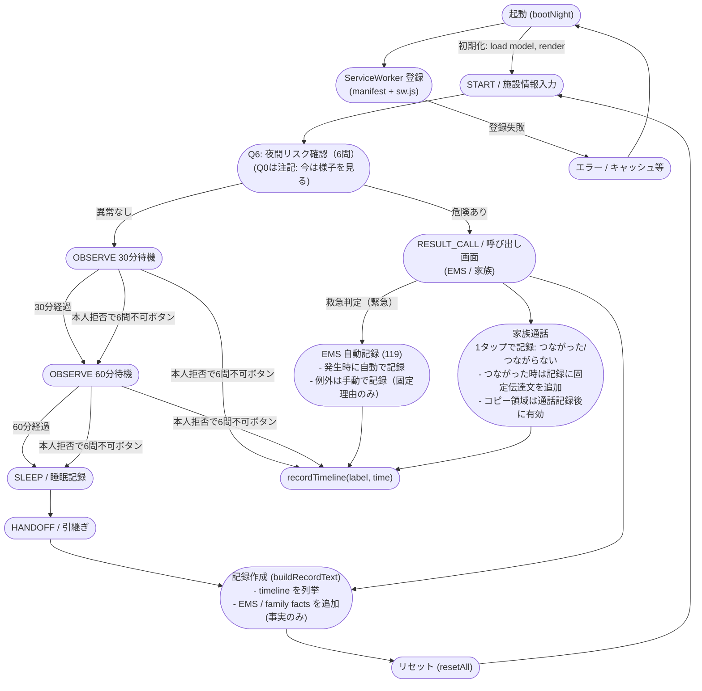

# Night Checker フローチャート

以下は night checker の主要フローを示す Mermaid 図です。`docs/night.js` の状態遷移（state）と主要な副作用（timeline 記録、119/家族通話、記録生成）を含みます。

## 説明（要点）
- 各画面は `model.state` に対応します。主要遷移は START → Q6 → RESULT_CALL/OBSERVE → SLEEP → HANDOFF → RECORD です。
- Q0 は Q6 の一部ではなく「注記（非対話）」として表示されます（ユーザ入力不要）。
- RESULT_CALL では EMS（119）の自動記録ルールと、家族通話の 1 タップ記録（接続/未接続）があり、家族の自由記述は記録されません。
- OBSERVE 画面の「本人拒否で6問不可（記録）」ボタンは timeline に記録して次に進めます。
- `buildRecordText()` は timeline と EMS / family facts を結合して「事実のみ」のテキストを出力します（自動送信は行わない設計）。

---

このファイルをそのままリポジトリに追加しました。図の細分化（例えば `RESULT_CALL` 内の UI フロー詳細、`buildRecordText()` の出力フォーマットなど）を希望すれば続けて作ります。
